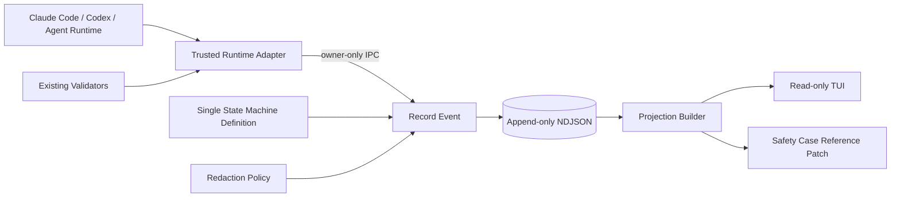

# Agent Safety Lifecycle リアルタイム可視化 Design Doc

- **Status:** Proposed
- **対象リポジトリ:** [`53able/agent-safety-lifecycle`](https://github.com/53able/agent-safety-lifecycle)
- **基準リビジョン:** `df510044d332a64a9ab710fd42b7732caf887273`（v0.1.0）
- **対象変更:** エージェントの実行状態、権限境界、承認待ち、成果物検査をローカル画面でリアルタイム表示する
- **対象外:** sandbox、credential broker、承認機構そのものの実装

## 1. 要約

Agent Safety Lifecycleには、実行profile、Autonomy Envelope、状態機械、result gate、Safety Caseがすでに定義されている。しかし、利用者が実行中に確認できるのは、主に個別のJSON、Markdown、CLI出力である。

本変更では、これらの判断を置き換えず、実行基盤が発行した構造化イベントを読み取り専用の画面へ表示する。利用者は次を一画面で確認できる。

- エージェントが現在どの状態にいるか
- 何を許可され、何を禁止されているか
- どの処理を実行し、どこで失敗または再試行したか
- 追加権限や人間判断を待っているか
- 生成物がresult gateでどの判定を受けたか
- 何が未検証のまま残っているか

monitorは安全判断を行わない。既存validatorが保証する範囲を変えず、全体判断はSafety Caseへ集約する。状態遷移表は機械可読な定義を一つだけ正本とし、既存CLIと可視化側が同じ定義を読む。表示は、その結果を整形するPresenterとして扱う。

なお、基準リビジョンには常駐supervisor、event producer、monitorの配布契約が存在しない。したがって最初の成果は「保存済みeventのreplay prototype」とし、現行CLIから一つの実eventを生成・保存・表示できるvertical sliceを通過するまで、リアルタイム統合済みとは扱わない。

## 2. 背景と問題

現在の設計では、`agent-run-supervisor`が次の状態を管理する。

```text
PLANNED
RUNNING
RETRYING
AWAITING_ELEVATION
AWAITING_RESULT_GATE
COMPLETED
FAILED
BLOCKED
STOPPED
```

状態変更は`validate-transition.py`で検査し、最終的な判断と証拠参照は`agent-safety-case.md`へ集約する。一方、`run-state.template.json`の`events`は空配列として定義されているだけで、イベント形式、書込み主体、順序、再接続、表示方法は決まっていない。

この状態では、特にAIに慣れていない利用者が次を判断しにくい。

- 作業が正常に進んでいるのか、停止しているのか
- AIが現在どの能力を使っているのか
- 追加承認が必要なのか、待てばよいのか
- 再試行が上限へ近づいているのか
- `COMPLETED`と表示される根拠が何か
- `UNVERIFIED`がどこに残っているのか

後から読むSafety Caseだけでは、実行中の介入判断には遅い。反対に、raw logをそのまま流すと、秘密情報、長大な出力、モデルの自己申告が混ざり、利用者が安全状態を判断しにくくなる。

## 3. 設計上の問い

> 既存の安全判断をUIへ移さず、実行中の状態と根拠を、初心者にも追える形でどう表示するか。

この問いに対する設計方針は次のとおり。

1. 実行基盤・validatorが発行した構造化イベントだけを表示する。
2. UIは読み取り専用とし、v1では承認や停止を実行しない。
3. Safety Caseを全体判断の正本として維持する。
4. 実行履歴は追記型イベントログとして保存し、現在状態を再構築できるようにする。
5. raw logや任意payloadを既定で保存・表示しない。

## 4. 目標

### 4.1 機能目標

- 一つのrunについて、現在状態と状態遷移履歴を表示する。
- profile、envelope hash、許可能力、禁止能力、resource limitを表示する。
- retry回数、経過時間、承認待ち、result gate判定を表示する。
- run stateの`BLOCKED`、`STOPPED`と、result gate decisionの`UNVERIFIED`を別の欄で表示する。
- eventから現在状態を再構築し、run終了後にも再生できるようにする。
- evidence参照を表示する。ただし、宣言されたartifact rootの外へは遷移しない。
- 既存のSafety Caseへ、イベントログと最終projectionの参照を追加できるようにする。

### 4.2 品質目標

以下は実測結果ではなく、実装時に検証する**設計目標**である。

- ローカル実行では、イベント確定から画面反映まで1秒以内を目標とする。
- viewerを再起動しても、event logを再生して最後のrun内sequenceから追従し、同じeventを二重表示しない。
- 不正な状態遷移をUI側で補正せず、`INVALID_EVENT`として表示する。
- terminal stateへ到達したrunの状態を、後続イベントで変更しない。
- ESC、CSI、OSC、C0/C1、bidi制御文字を含むevent文字列をterminal命令として解釈せず、可視化または拒否する。
- 既存のvalidatorと26件のテストを壊さない。

### 4.3 非目標

- TUIから`Approve`、`Stop`、`Retry`を実行すること
- Claude Code、Codex、その他の実行環境を置き換えること
- sandboxやnetwork policyをUIだけで強制すること
- raw terminalをブラウザへミラーすること
- AIの思考過程や非公開推論を表示すること
- クラウド監視サービスを提供すること
- 複数組織向けの認証、権限、テナント分離を実装すること
- 「安全スコア」を算出すること

## 5. Actorとユースケース

| Actor | 目的 | 主なユースケース |
|---|---|---|
| Operator | 実行中の状態を理解する | 現在状態、許可・禁止能力、進行中処理、承認待ちを確認する |
| Reviewer | 成果物を取り込めるか判断する | result gate判定、evidence、未検証事項を確認する |
| Safety policy owner | 境界が期待どおり機能したか確認する | capability request、境界違反、停止理由を追跡する |
| Integrator | 実行基盤を可視化へ接続する | 共通event contractへ変換して発行する |
| Beginner | 安全ライフサイクルを学ぶ | 状態遷移と人間ハンドオフの位置を画面で理解する |

### 5.1 中心ユースケース

#### UC-1：実行状態を監視する

1. Operatorがtask IDまたはrun IDを指定してmonitorを開く。
2. システムが既存イベントを再生して現在状態を構築する。
3. 新しいイベントを受信するたびにtimelineとsummaryを更新する。
4. terminal stateへ到達したら、最終状態とresult gate判定を固定表示する。

#### UC-2：承認待ちの理由を確認する

1. runが`AWAITING_ELEVATION`へ遷移する。
2. 画面に要求能力、目的、範囲、有効期限、代替案、拒否時の影響を表示する。
3. Operatorは既存の承認経路で判断する。
4. UIは承認操作を代行しない。

#### UC-3：終了後にrunを再生する

1. Reviewerが保存済みevent logを開く。
2. システムがsequence順に状態を再構築する。
3. 各状態の根拠とevidence参照を表示する。
4. 欠落、重複、不正遷移があれば、正常な履歴として補完せず警告する。

## 6. 保持する既存の振る舞い

### 6.1 現行CLIが機械的に保証していること

- `validate-transition.py`で許可されていない状態edgeは拒否する。
- active stateからterminal stateへの遷移と、定義済みの非terminal遷移だけを許可する。
- result gate report validatorは、必須検査とdecisionの整合性を検査する。

### 6.2 現行SKILL.mdが運用規則として要求していること

- `COMPLETED`はresult gateが`IMPORTABLE`を返した場合だけ許可する。
- envelopeや実行環境が未検証ならrunを開始しない。
- terminal stateは変更しない。
- `UNVERIFIED`を合格へ変換しない。
- Safety Caseの証拠参照が存在しなければ完了扱いにしない。
- スキルはOSレベルの強制境界として扱わない。

後者は現行transition CLI単体では強制されない。本設計では、状態edgeの検査と、同一run・artifact・envelopeに対する`IMPORTABLE`を要求するapplication invariantを分離する。可視化はどちらも独自に再解釈せず、検査結果を観測可能にする。

## 7. 現状確認

基準リビジョンに対して次を実行した。

```bash
python3 scripts/validate-project.py
python3 -m unittest discover -s tests -v
```

観測結果：

- 確認時刻：2026-09-19T11:49:22Z
- commit：`df510044d332a64a9ab710fd42b7732caf887273`
- Python：3.14.6
- OS：Darwin 25.6.0 arm64
- working tree：変更なし
- project validator：終了code 0、10スキルを検出
- unit test：終了code 0、26件成功

実行時間は環境差が大きく、受入基準には使わない。この結果は上記commitと環境に限定される。可視化実装後も同じコマンドを回帰確認に使う。

## 8. アーキテクチャ判断

### 8.1 採用案：TUI-first

- event contract、状態projection、redaction policyは**source-level分離**とする。
- 状態edgeは`skills/agent-run-supervisor/assets/state-machine.json`へ機械可読に定義し、既存CLIとEvent Coreが同じ定義を読む。状態規則を二重実装しない。
- producerは`sequence`、`recorded_at`、`source`を指定しない。`RecordEvent`が検証後に採番し、接続したadapter identityからsourceを付与する。
- 初期のevent ingressはowner-onlyのローカルIPCとする。POSIXではUnix domain socketを候補とし、Windows対応は実装前に別途検証する。
- trusted adapterはguest内のagent processから分離したhost側で動かす。monitor manifestにadapter IDと許可sourceを固定し、起動時にadapter固有tokenを継承file descriptorで渡す。agentへtokenとsocketを公開しない。
- 同一OS userのhost processまで敵対的とみなす環境では、owner-only socketだけではidentityを証明できない。その場合は専用OS userまたは別のbroker境界が必要であり、MVPの検証範囲外とする。
- v1の表示は、別terminalまたはpaneで動く**読み取り専用TUI process**とする。
- TUIはNDJSONをsequence cursorでpollし、`RunProjection`から作ったview modelだけを表示する。writerからviewerへのpush経路は設けない。
- TTYではANSIによるatomic redraw、非TTYではnewline-delimited snapshotを出力する。full-screen cursesは必須にしない。
- event logは追記型NDJSONとする。
- Safety Caseは全体判断の正本として維持し、monitorは直接更新せず参照patchを生成する。

TUIを選ぶ理由は、現在の利用者がClaude CodeやCodexをterminalから使う開発者であり、1 runの状態監視は別paneで完結するためである。HTTP、SSE、browser authentication、HTML/JavaScriptという新しい境界を追加せず、event producerとprojectionの正しさを先に検証できる。

一方、初心者向け説明、複数run、別端末閲覧、長いevidenceの比較、Webアクセシビリティが必要になればbrowserの便益が上回る。browserはTUIで満たせない要求を利用者テストで確認した後のpromotion候補とする。

現状のSkills CLIは`skills/`配下を配布するが、提案する`tools/`の配布は保証しない。MVPはリポジトリ開発者向けtoolとして起動し、一般利用へ進む前にpackageとentry pointを定義する。この配布確認をPhase 0のhard gateとする。

### 8.2 全体構成



### 8.3 依存方向

```text
Framework / Driver
  Terminal, filesystem, runtime-specific hooks
        ↓
Interface Adapters
  Runtime event adapter, NDJSON store, terminal presenter, Safety Case exporter
        ↓
Application Policy
  RecordEvent, ReplayRun, WatchRun, BuildProjection
        ↓
Domain Policy
  RunEvent, RunProjection, TransitionPolicy, RedactionDecision
```

内側のpolicyは、Claude Code SDK、Codex形式、terminal制御、filesystem path objectへ依存しない。

## 9. Component設計

### 9.1 Event Core

**責務**

- event typeごとの必須項目と不変条件を定義する。
- machine-readableな既存状態表を読み、state transitionを検査する。
- event列からrun state、stream integrity、result gate decision、handoff statusを別々に構築する。
- terminal stateを保護する。
- `COMPLETED`に必要なresult gate bindingをapplication invariantへ渡す。

**公開契約**

```text
validate_event(event, previous_projection) -> ValidationResult
apply_event(previous_projection, event) -> RunProjection
```

**依存先**

- Python標準ライブラリだけ
- terminal、filesystem、特定runtimeへ依存しない

### 9.2 Monitor Application

**責務**

- eventの受付、検証、redaction、保存を順に実行する。
- 保存済みeventを再生する。
- sequence cursor以降のeventを読み、projectionとview modelを更新する。

**主なuse case**

```text
RecordEvent
ReplayRun
WatchRun
ExportRunSummary
```

### 9.3 Runtime Adapters

**責務**

- Claude Code、Codex、CLI validatorなどの出力をproducer eventへ変換する。
- runtime固有の型やpayloadを内側へ漏らさない。
- owner-only IPCで`RecordEvent`へ接続する。
- sourceはpayloadへ書かず、認証済みadapter IDからserver側が付与する。
- adapter IDと許可sourceの対応はmonitor manifestでallowlist化し、起動時tokenの失効はmonitor終了時とする。

初期実装では、特定製品の非公開hookへ依存しない。最初のvertical sliceはhost側で既存validatorを実行するCLI adapterとし、1件のtransition結果を保存・再生・表示する。

### 9.4 Event Store Adapter

**責務**

- runごとにNDJSONを追記する。
- run単位のcritical section内で、dedupe検査、最新projectionの再構築、application invariant検査、sequence採番、durable append、projection更新を直列化する。
- sequence順にeventを読み出す。
- 不完全な末尾行、event ID conflict、sequence conflict、欠番を検出する。
- 再起動前に不完全な末尾をquarantineし、正常な最終eventから採番を再開する。

**所有状態**

- `events.ndjson`
- runごとの次sequence

MVPでは`RecordEvent` processを唯一のwriterとする。同じproducer event IDと同じcanonical payloadの再送だけをidempotent successとし、異なるpayloadは拒否して監査対象にする。acknowledgementはdurable append後に返す。配信に失敗しても保存済みeventを再生できる。複数writerへの対応は対象外とする。

### 9.5 Terminal Presenter

**責務**

- 現在projectionをpresentation-neutralなview modelへ変換する。
- `EventStore.read(run_id, after_sequence)`を一定間隔で呼び、新しいeventだけを反映する。
- TTYでは一画面を再描画し、非TTYではsequence付きsnapshotを追記する。
- viewer再起動時はevent logをfull replayし、その後は最終sequenceから追従する。

Presenterは安全判断を行わず、状態を補正しない。

### 9.6 Terminal View

**責務**

- 状態、能力、timeline、evidence、警告を表示する。
- event内の制御文字をterminal命令として解釈しない。
- 色だけに依存せず、ラベルと記号を併用する。
- 狭いterminalではsummaryを切り詰めても、run state、handoff、result gate、stream integrityを常に残す。

v1では書込み操作とkeybindingを持たない。`--once`でsnapshot、`--watch`で継続表示する。

## 10. Event contract

### 10.1 Producer eventとpersisted eventを分ける

producerは観測内容だけを送る。`sequence`、`recorded_at`、`source`は送信者に決めさせず、認証済みadapterとEvent Storeが付与する。

```json
{
  "schema_version": "1.0",
  "producer_event_id": "producer-unique-id",
  "task_id": "frontend-test-fix",
  "run_id": "run-example",
  "occurred_at": "2026-09-19T08:00:00Z",
  "type": "STATE_TRANSITION",
  "summary": "RUNNINGからRETRYINGへ遷移",
  "state": {
    "from": "RUNNING",
    "to": "RETRYING"
  },
  "evidence_refs": ["logs/test-failure.txt"],
  "details": {"retry_count": 1}
}
```

保存時に次を付加する。

```json
{
  "event_id": "store-generated-id",
  "sequence": 12,
  "recorded_at": "2026-09-19T08:00:00Z",
  "source": "validator"
}
```

例に含まれるIDと時刻は形式例であり、実測値ではない。

### 10.2 Schema制約

`run-event.schema.json`はevent typeごとのdiscriminated unionとする。

- `run_id`、`task_id`、IDにはpath separator、`..`、制御文字を許可しない。
- `summary`、配列数、文字列長、event全体bytes、JSON depthに上限を設ける。具体値はPhase 0の実測後に固定する。
- `details`を自由objectにせず、event typeごとに許可fieldを列挙する。
- 未知fieldは保存しない。
- producerにartifact rootを自由入力させない。monitorが設定済みrun root配下へ専用directoryを割り当て、verified envelope hashとoutput contractに結び付ける。
- run root自体がmonitor起動時allowlist配下にあることをRUN_CREATED時とfile access直前の両方で検査する。
- evidenceは割り当て済みartifact rootからの相対pathだけを許可する。
- evidence表示時はresolved containmentを再確認し、symlinkと特殊fileを拒否する。
- MVPではevidenceをクリック可能にせず、検査済みの参照文字列として表示する。

既知patternと未許可fieldは拒否できるが、未知形式の秘密情報を完全には検出できない。この点を残存リスクとして扱う。

### 10.3 event type

| Type | 用途 | 状態を変更するか | 主な必須binding |
|---|---|---:|---|
| `RUN_CREATED` | run初期化 | `PLANNED`へ初期化 | sequence 1、envelope hash、artifact root。initial stateはproducer入力ではなくserverが`PLANNED`に固定 |
| `STATE_TRANSITION` | 検証済み状態遷移 | はい | from、to、遷移根拠event ID |
| `ACTION_STARTED` | 許可済み処理の開始 | いいえ | capability、action ID |
| `ACTION_COMPLETED` | 処理の完了 | いいえ | action ID |
| `ACTION_FAILED` | 処理の失敗 | いいえ | action ID、error category |
| `RETRY_CONSUMED` | retry budget消費 | いいえ | retry count |
| `CAPABILITY_REQUESTED` | 追加能力の要求 | いいえ | capability、目的、範囲、期限 |
| `CAPABILITY_DECIDED` | 既存承認経路の結果 | いいえ | request event ID、decision |
| `BOUNDARY_VIOLATION` | 境界違反 | いいえ | evidence。別途`STOPPED`遷移が必要 |
| `RESULT_GATE_DECIDED` | 成果物判定 | いいえ | report path/hash、artifact digest、run ID、envelope hash、decision |
| `EVIDENCE_ATTACHED` | 証拠参照の追加 | いいえ | target event ID、evidence ref |

heartbeatはMVPから外す。導入時は無通信を異常とみなすtimeout policyを別に設計する。

`BOUNDARY_VIOLATION`を表示しただけで状態を変更しない。正規の`STATE_TRANSITION`で`STOPPED`へ遷移する。

### 10.4 Result gate report v2と`COMPLETED` invariant

現行v0.1.0のresult-gate reportは`run_id`、`envelope_hash`、`artifact_digest`を持たず、既存validatorもこれらを検査しない。そのままではevent側へdigestを併記しても、検査対象artifactとの結合を証明できない。

可視化を完了判断へ接続する前に、result-gate reportをv2へ更新し、次をreport本体の検証対象fieldにする。

- `run_id`
- `envelope_hash`
- validator version
- 検査対象のcanonical artifact manifest
- manifest全体のdigest
- 検査時刻
- 既存checks、decision、evidence、destination

canonical artifact manifestは、artifact rootからの相対path、file type、byte size、各fileのSHA-256をpath順に並べたものとする。validator自身がmanifestを生成してreportへ格納し、adapterから任意digestを受け取らない。report hashはvalidator成功後のcanonical reportから計算する。

`AWAITING_RESULT_GATE -> COMPLETED`を受理するには、直前までに有効な`RESULT_GATE_DECIDED`が必要である。そのeventは、validatorが出力したv2 reportからのみ生成し、次をすべて満たす。

- decisionが`IMPORTABLE`
- run IDとenvelope hashが現在runと一致
- canonical artifact manifest digestが現在artifactと一致
- report hashが保存済みreportと一致
- report validatorの成功証拠がある
- 以前のrunで使われたdecision eventを再利用していない

この規則は単純なstate edgeではなく、`RecordEvent`のapplication invariantとして検査する。result-gate v2が実装されるまで、画面は判定を参考表示に留め、`COMPLETED`の根拠として扱わない。

### 10.5 sourceの扱い

- `runtime`: sandbox、broker、実行processが観測した事実
- `validator`: 決定的なvalidatorの判定
- `user`: 人間が既存経路で行った判断
- `agent-reported`: AI自身が報告した内容

sourceはpayloadから受け取らず、monitor manifestに登録されたadapter IDと起動時tokenを検証して付与する。adapterごとに許可sourceを固定し、`agent-reported` adapterが`validator`を名乗れないようにする。`agent-reported`は観測事実と同じ見た目にせず、境界検証や完了判定の証拠として単独利用しない。

## 11. 状態所有と整合性

| 状態 | 所有component | 更新者 | 回復方法 |
|---|---|---|---|
| Autonomy Envelope | 既存envelope工程 | 既存validatorを通過した更新だけ | hashと履歴から復元 |
| Runtime event log | Event Store | `RecordEvent` processだけ | NDJSON replay |
| Current projection | Projection Builder | event適用だけ | event logから再構築 |
| Safety Case | Lifecycle router | 各工程の検証結果を集約 | evidence参照から再確認 |
| Terminal view | Terminal View | event logのread-only tailだけ | full replay後に最終sequenceから追従 |

### 11.1 正本の分離

- **状態edgeの正本:** machine-readable state machine definition
- **全体判断の正本:** Safety Case
- **実行履歴の証拠:** event log
- **現在状態の派生値:** projection
- **表示:** Terminal View

monitorはSafety Caseを直接変更せず、event log hashと最終projectionを追記するためのpatchを生成する。UI障害や表示遅延があっても、実行判断へ影響させない。

### 11.2 Projectionの次元

| Field | 値 | 意味 |
|---|---|---|
| `run_state` | 既存9状態 | supervisorの実行状態 |
| `stream_integrity` | `OK` / `INCOMPLETE` / `INVALID` | event列を信頼して再生できるか |
| `result_gate_decision` | `IMPORTABLE` / `REVIEW_REQUIRED` / `REJECTED` / `UNVERIFIED` / `NONE` | 成果物検査の判定 |
| `handoff_status` | `NONE` / `ELEVATION_REQUESTED` / `HUMAN_ACTION_REQUIRED` | 人間判断の要否 |

Lifecycle routerの`PAUSED`はv1では`handoff_status`として表現し、run stateへ追加しない。状態機械へ新しいstateを加える場合は互換性変更として別途決定する。

### 11.3 順序、重複、原子性

- `RUN_CREATED`をsequence 1、一度限りとし、producerからinitial stateを受け取らず、serverが`run_state=PLANNED`を初期化する。
- sequenceはEvent Storeがrun内で単調増加させる。
- producer event IDとcanonical payloadがともに一致する再送だけをidempotent successとする。
- 同じIDで異なるpayload、同じsequenceで異なるeventは拒否する。
- sequence欠番または逆行ではrun stateを変更せず、`stream_integrity=INCOMPLETE`または`INVALID`とする。
- terminal transition後の状態変更eventは拒否する。

`RecordEvent`はrun単位で直列化する。critical sectionには、重複確認、最新eventからのprojection再構築、schema・state・application invariant検査、採番、1行append、flush/fsync、projection commitを含める。publishはappend後に行い、失敗時は保存済みeventから再配信する。これにより、同じprevious stateを見た二つのtransitionが同時にvalidになる競合を防ぐ。

### 11.4 Terminal後のevent admissibility

| Terminal run state | 許可するevent | 変更できるprojection field |
|---|---|---|
| `COMPLETED` / `FAILED` / `BLOCKED` / `STOPPED` | 既存eventを対象とする`EVIDENCE_ATTACHED`だけ | evidence参照だけ |

terminal後は`RESULT_GATE_DECIDED`、`CAPABILITY_REQUESTED`、`CAPABILITY_DECIDED`、action event、追加のstate transitionを拒否する。追加evidenceはrun state、result gate decision、handoff statusを変更できない。最終判断を覆す情報が見つかった場合は、既存runを書き換えず、near-missまたは新しいfollow-up runとして記録する。

## 12. UI情報設計

### 12.1 画面構成

```text
┌──────────────────────────────────────────────────────┐
│ Task / Run     State       Profile      Elapsed      │
├───────────────────────────┬──────────────────────────┤
│ 現在の処理                │ 権限境界                 │
│ ACTION_STARTED            │ Allowed / Denied         │
│ retry 1 / 3               │ Network / Credentials    │
├───────────────────────────┴──────────────────────────┤
│ 承認・警告                                           │
│ Run: AWAITING_ELEVATION / Stream: OK                  │
│ Result: UNVERIFIED / Handoff: ELEVATION_REQUESTED     │
├──────────────────────────────────────────────────────┤
│ Timeline                                             │
│ 10:00 RUNNING                                        │
│ 10:02 test failed                                    │
│ 10:03 RETRYING                                       │
├──────────────────────────────────────────────────────┤
│ Result Gate / Evidence / Residual Risks               │
└──────────────────────────────────────────────────────┘
```

### 12.2 表示優先順位

1. 人間の判断が必要か
2. 現在状態と停止理由
3. 許可・禁止能力
4. 現在の処理とretry budget
5. result gate判定
6. evidenceと詳細timeline

初心者向け画面では、raw state名だけでなく短い説明を併記する。

例：

```text
AWAITING_RESULT_GATE
成果物を取り込む前の検査を待っています
```

### 12.3 TUIの動作

- Agent本体とは別terminalまたはpaneで起動する。
- `--once`は現在snapshotを一度だけ出力する。
- `--watch`はevent logをpollし、設計目標として1秒以内に表示へ反映する。
- TTYではANSI redrawを使用できるが、event由来文字列を制御sequenceへ連結しない。
- 非TTY、`NO_COLOR`、幅の狭いterminalでも、文字ラベルだけで状態を判別できるようにする。
- terminal幅、切詰め、Unicode幅の扱いはcomponent testと実terminal確認の両方で検証する。

### 12.4 表示しない情報

- モデルの非公開推論
- 環境変数の値
- credential、token、cookie
- raw request/response body
- host homeの絶対path
- 未制限のterminal出力

## 13. SecurityとPrivacy

### 13.1 主な脅威

| 脅威 | 対策 |
|---|---|
| terminal control injection | 全表示fieldのESC、CSI、OSC、C0/C1、bidi制御文字、任意改行を可視escapeまたは拒否する。event文字列からterminal title、clipboard、hyperlink、cursor命令を生成しない |
| 秘密情報の記録 | event type別allowlist、既知credential patternの保存前拒否、raw payload禁止。未知形式のsecretは検出できない残存リスクとして明記する |
| evidence path traversal | RUN_CREATEDでartifact rootを固定し、root-relative path、resolved containment、symlink拒否を要求する |
| 偽の完了event | 同一run・envelope・artifactに結び付いたresult gate reportとvalidator証拠を要求する |
| 偽のsource | guestから到達できないhost側ingressとadapter identityにより、sourceをserver側で付与する |
| AI自己申告の過信 | sourceを表示し、`agent-reported`単独で完了判定しない |
| UIからの権限昇格 | v1を読み取り専用にし、keybindingやcommand executionを持たせない |
| 大量eventによる画面停止 | eventサイズ、表示件数、1fieldの表示行数へ上限を設ける |
| ログ改変 | Phase 0の`Stream: OK`はschema・sequence・projectionの構造検査だけを意味し、tamper proofではない。Safety Caseへのevent log hash記録は後続phaseで実装し、改変耐性ではなく改変検出として扱う |

### 13.2 信頼境界

monitorは、表示対象のeventを未信頼入力として扱う。runtime adapterが生成したeventであっても、schema、サイズ、文字列、pathを検査してから保存する。TUIはevent storeをread-onlyで開き、event ingestionや外部commandを受け付けない。

trusted adapterはhost側、agent runtimeはguest側に分離する。guestからhost ingressへ到達できる構成は検証対象外とし、`BLOCKED`として扱う。同一OS userの任意host processを敵対者へ含める場合、socket permissionとadapter tokenだけでは十分でないため、専用OS userまたは外部brokerを要求する。

可視化できたことを、sandboxやpolicyが有効である証拠にしない。境界の根拠は、`agent-boundary-adversary`や実行基盤の観測結果に置く。

## 14. 失敗時の振る舞い

| 失敗 | 振る舞い |
|---|---|
| event schema不正 | 保存せず`INVALID_EVENT`を別監査ログへ記録する |
| 不正な状態遷移 | projectionを変更せず警告する |
| NDJSON末尾が不完全 | 最後の完全なeventまで再生し、`stream_integrity=INCOMPLETE`と表示する。次回append前に末尾をquarantineする |
| sequence欠番 | run stateを変えず`stream_integrity=INCOMPLETE`とし、再取得を要求する |
| event log read失敗 | 最後に表示したsequenceを保持して待機し、回復後に差分を読む。process再起動時はfull replayする |
| TUI停止 | event producerや既存validatorを止めない。再起動後にeventを再生する |
| redaction失敗 | eventを保存・配信せず、monitor側をfail closedにする |
| evidence参照不明 | result gate欄を`UNVERIFIED`として表示し、リンクを作らない |
| event store書込み失敗 | producerへ失敗を返す。観測不能なまま継続するかは呼出し元policyで`BLOCKED`判定する |

## 15. ディレクトリ案

```text
skills/
  agent-run-supervisor/
    assets/
      state-machine.json

schemas/
  run-event.schema.json

tools/
  safety-monitor/
    core/
      events.py
      projection.py
      state_machine_reader.py
      redaction.py
    application/
      record_event.py
      replay_run.py
      watch_run.py
    ports/
      event_store.py
      clock.py
    adapters/
      ndjson_event_store.py
      cli_event_adapter.py
      safety_case_exporter.py
      terminal_presenter.py
    main.py

tests/
  test_event_contract.py
  test_projection.py
  test_redaction.py
  test_ndjson_store.py
  test_terminal_resume.py
  test_terminal_escaping.py
  test_monitor_security.py
```

これはcomponentの独立リリースを意味しない。初期段階では同じリポジトリ、同じバージョン、同じテスト単位で管理する。別packageやserviceへ分割するのは、独立した利用者とリリース周期が確認された後に再評価する。

## 16. Port / Adapter契約

### 16.1 EventStore port

```python
class EventStore(Protocol):
    def append(self, event: ProducerEvent, adapter_identity: AdapterIdentity) -> AppendResult: ...
    def read(self, run_id: str, after_sequence: int = 0) -> Iterable[RunEvent]: ...
```

利用側はproducerの観測内容とadapter identityを渡し、Event Storeがpersisted `RunEvent`を返す。NDJSON行、filesystem handle、caller指定のsequenceやsourceを契約へ含めない。

### 16.2 Push配信portを作らない判断

v1のviewerは`EventStore.read(run_id, after_sequence)`をread-onlyで呼び出す。writerからviewerへのpublish契約を追加しない。`RunProjection -> MonitorViewModel`は純粋変換とし、将来browserを追加する場合も同じview modelを再利用する。

### 16.3 Redactor portを作らない判断

v1のredaction規則は安全policyの一部であり、差し替え要件が確認されていない。そのため抽象portを作らず、内側のpolicyとして実装する。外部DLP製品との連携が必要になった時点で境界を再評価する。

## 17. 実装計画

### Phase 0：配布・起動・producerのvertical slice

- monitorをSkills CLIとは別のrepository development toolとして起動する暫定entry pointを決める。
- `agent-run-supervisor`が現在は手順書であり、常駐processではないことを前提に、`RecordEvent` processをwriterとして定義する。
- 既存`validate-transition.py`を呼ぶhost側CLI adapterを一つ作る。
- monitor manifestへadapter IDと許可sourceを登録し、起動時tokenで接続を検証する。
- `RUN_CREATED`と1件の`STATE_TRANSITION`をowner-only IPC経由で保存する。
- 保存済みeventからtext snapshotを生成する。
- 一般配布へ進む前に、package、entry point、Skills CLIとの関係を決定する。

**Hard gate:** 1 producer → 1 append → 1 projection → 1 text snapshotが動かない限り、live TUIを実装しない。

### Phase 1：状態定義とevent contract

- 現行state machineへcharacterization testを追加する。
- 状態edgeをmachine-readableな一つの定義へ移し、既存CLIとEvent Coreから共有する。
- event type別`RunEvent` schemaを定義する。
- result-gate report v2とcanonical artifact manifestを定義し、validatorへbinding検査を追加する。
- event列から複数次元の`RunProjection`を作る純粋関数を実装する。
- 重複、欠番、不正遷移、terminal後event、別runのresult report再利用をテストする。
- 既存`run-state.json`とのcompatibility tableを文書化する。

**停止条件:** projectionの期待結果をfilesystemやterminalなしにテストできない場合、境界設計へ戻る。

### Phase 2：NDJSON event store

- `RecordEvent`を単一writerとして追記するadapterを実装する。
- run単位critical sectionへvalidation、採番、durable append、projection commitをまとめる。
- server-side sequence、同一ID/異payload conflict、並行transition、原子的append、不完全末尾、再起動をテストする。
- event log hashを算出し、Safety Caseへの参照patchを生成する。

**停止条件:** 複数writerが必要になった場合、暗黙にロックを追加せず、所有者と順序保証を再設計する。

### Phase 3：読み取り専用live TUI

- `--once`と`--watch`を実装する。
- `--watch`はNDJSONをsequence cursorでpollし、1 run、heartbeatなし、上限付きtimelineを表示する。
- TTYではatomic redraw、非TTYではnewline-delimited snapshotを出力する。
- 状態、能力、timeline、result gate、未検証事項を表示する。
- terminal control injection、path traversal、偽source、大きなeventを反証テストする。
- 既存validatorを連続実行する実flowを別paneから観測し、保存済みreplayだけでなくlive追従を確認する。

### Phase 4：追加runtime adapter

- Claude Code、Codex固有adapterは、利用可能な公開hookと契約を別途確認してから追加する。
- adapterごとに取得できる事実と`agent-reported`を区別するcontract testを追加する。

### Phase 5：onboardingとbrowser promotion判定

- `agent-safety-onboarding`の演習でTUIを任意利用できるようにする。
- 初心者がrun state、権限境界、承認待ち、result gateを説明できるかユーザー検証する。
- 複数run、別端末閲覧、長いevidence比較、Web支援技術対応など、TUIでは満たせない要求を記録する。
- browser固有の便益が確認された場合だけ、同じ`MonitorViewModel`を使うWeb adapterを別Design Docで設計する。

TUIからの承認・停止操作、heartbeat、browser、remote modeは別Design Docまたは実測後の拡張として扱う。

## 18. 最小テスト・オラクル

実装開始前に、次を最低限のoracleとして固定する。

| ID | 反証する主張 | 入力 | 期待結果 |
|---|---|---|---|
| O-1 | 正規遷移だけを表示できる | `RUNNING -> RETRYING` | `run_state=RETRYING`になる |
| O-2 | 不正遷移を隠さない | `COMPLETED -> RUNNING` | event拒否、run stateは`COMPLETED`のまま |
| O-3 | result gateなしで完了しない | `AWAITING_RESULT_GATE -> COMPLETED`、判定欠落 | 完了拒否 |
| O-4 | 別runの合格を再利用しない | 異なるrun IDまたはenvelope hashの`IMPORTABLE` | 完了拒否 |
| O-5 | 同一再送だけを冪等に扱う | 同じproducer event ID・同じpayloadを2回 | 保存・表示は1回 |
| O-6 | ID conflictを拒否する | 同じproducer event ID・異なるpayload | 拒否して監査記録 |
| O-7 | 欠番を推測しない | sequence 1の次に3 | run stateは不変、`stream_integrity=INCOMPLETE` |
| O-8 | terminal control injectionを実行しない | ESC、CSI、OSC、bidi制御文字を含むsummary | 可視escapeまたはevent拒否。terminal状態は変化しない |
| O-9 | 未許可fieldと既知token patternを保存しない | token形式を含む未許可details | event拒否またはredaction |
| O-10 | 偽sourceを受け付けない | agent adapterのtokenでvalidator source相当eventを送信 | identity不一致で拒否、event未保存 |
| O-11 | evidence rootを越えない | `../secret`またはsymlink | 参照拒否 |
| O-12 | UI障害がrunを変更しない | monitor停止 | run stateは不変 |
| O-13 | viewer再起動後に追従できる | TUI停止中にeventを追加して再起動 | full replay後、最終sequence以降だけを追従 |
| O-14 | terminal stateを保護する | terminal後のstate event | 拒否 |
| O-15 | crash後も採番が衝突しない | 不完全末尾を含むlogで再起動 | 末尾をquarantineし、最終正常sequenceから再開 |
| O-16 | adapterが別sourceを名乗れない | agent adapterのtokenでvalidator eventを送信 | 拒否して監査記録 |
| O-17 | 同時transitionを直列化する | 同じRUNNINGを前提に2件を並行送信 | 一方だけを先にcommitし、他方を最新projectionで再検査 |
| O-18 | 任意artifact rootを受け付けない | `/`、host home、allowlist外root | RUN_CREATED拒否 |
| O-19 | report v1を完了根拠にしない | digest bindingのない`IMPORTABLE` report | 参考表示のみ、完了拒否 |
| O-20 | terminal後の判断を変更しない | `COMPLETED`後の`RESULT_GATE_DECIDED(REJECTED)` | event拒否、全判断fieldは不変 |

### 18.1 検証レベル

- **Unit:** transition、projection、redaction、view model
- **Component:** NDJSON replay、破損回復、TUI再起動、sequence cursor
- **Contract:** runtime adapterから共通eventへの変換
- **E2E:** 実validator flowをPTYと非TTYの両方で追跡
- **Adversarial:** terminal control injection、path traversal、secret、重複、欠番、大量payload
- **Regression:** 既存26テストとproject validator

## 19. RolloutとRollback

### Rollout

1. リポジトリ開発者向けに、既定OFFのreplay prototypeを追加する。
2. 既存validatorからtext snapshotまでのvertical sliceを検証する。
3. owner-only ingress、event store、読み取り専用live TUIの順に拡張する。
4. 実validator flowを別paneから観測する。
5. `agent-safety-onboarding`だけで試験利用する。
6. 一般利用前にterminal control injection、秘密情報、偽source、pathのadversarial testを通す。
7. packageとentry pointを確定してから一般利用へ進む。
8. TUIで満たせない利用要求が確認された場合だけbrowserを再検討する。

### Rollback

- monitor processを停止しても既存validatorとagent runtimeは継続できる。
- event発行を無効化しても既存validatorとSafety Caseは動作する。
- UI固有ファイルを削除しても既存10スキルの契約を変更しない。
- event schema変更はversionを上げ、旧logのreaderを残すか移行手順を用意する。

## 20. UI選択の比較

| 案 | 境界とコスト | 利点 | 弱点 | 判断 |
|---|---|---|---|---|
| 読み取り専用TUI | terminal presenter、NDJSON polling | terminal作業と同じ場所で使える。HTTP、SSE、Web securityが不要 | 狭い画面、terminal差、制御文字対策が必要 | **v1で採用** |
| ローカルbrowser | HTTP server、SSE、HTML/JS、browser認証とsecurity | 情報量、説明、複数pane、Web支援技術との相性がよい | 現在の1 run要件には境界が重い | 要求確認後へ延期 |
| TUIからbrowserへ段階移行 | presentation-neutral view modelを共有 | coreを先に検証し、UI需要を実測できる | view modelをUI固有にすると二重実装になる | **全体戦略として採用** |

### 20.1 Browser promotion gate

次のいずれかが利用者テストまたは運用要求で確認された場合に、browser用Design Docを作る。

- 複数runを同時比較する必要がある。
- terminalとは別端末から閲覧する必要がある。
- 長いevidenceや残存リスクを並べて確認する必要がある。
- TUIでは初心者がrun state、権限境界、承認待ち、result gateを説明できない。
- terminalでは必要な支援技術要件を満たせない。

### 20.2 その他の不採用案

- **mutableな`run-state.json`のpolling:** 状態間の出来事、欠落、再試行を復元しにくい。append-only NDJSON tailとは区別する。
- **raw terminalの転送:** 秘密情報とノイズが多く、モデル報告と実行基盤の観測を区別できない。
- **UIからの承認・停止:** 認証、二重実行、監査、broker契約が必要になり、v1の変更範囲を超える。
- **クラウドservice:** 認証、テナント分離、ログ送信、運用責任が増え、現在の配布単位には過剰である。

## 21. 未決定事項

- `RunEvent` schemaをJSON Schemaだけで管理するか、Python modelも正本にするか。
- Safety Case参照patchを誰が確認・適用するか。
- heartbeatを将来導入するか。MVPには含めず、無通信を失敗とみなすtimeout policyと合わせて再検討する。
- runtime固有adapterが取得できる公開eventの範囲。
- Windowsを含むfilesystem追記、IPC、ANSI redrawの対応範囲。
- terminal幅、Unicode幅、refresh方式の対応範囲。
- event retentionと削除手順。
- 初心者向けcompact表示と専門家向けdetail表示を切り替えるか。
- browser promotion gateを満たしたと判断する利用者テストの方法。

これらは実装時に推測で埋めない。公開hook、対象OS、利用者テスト、保持要件を確認して決定する。

## 22. 成功条件

この変更は、次を満たしたときに完了候補とする。

- Operatorが現在状態、許可・禁止能力、人間判断の要否を一画面で説明できる。
- 不正event、欠番、未検証事項が正常表示へ紛れない。
- TUIが停止してもrun stateが変わらない。
- event logから同じprojectionを再構築できる。
- state edgeの定義が一つだけ存在し、既存CLIとEvent Coreが共有する。
- 既存validatorとテストが成功する。
- adversarial testでterminal control injection、path traversal、偽source、未許可field、既知token patternの無検査表示を拒否できる。
- 同一run・envelope・artifactに結び付かないresult gate判定を完了根拠に使わない。
- Safety Caseからevent logと最終projectionの証拠を追跡できる。

ユーザー検証と性能目標はまだ実施していない。現時点では設計上の受入条件であり、実装済み・検証済みの機能ではない。

## Sources

- [Agent Safety Lifecycle README](https://github.com/53able/agent-safety-lifecycle)
- [設計概要](https://github.com/53able/agent-safety-lifecycle/blob/df510044d332a64a9ab710fd42b7732caf887273/docs/design.md)
- [アーキテクチャ](https://github.com/53able/agent-safety-lifecycle/blob/df510044d332a64a9ab710fd42b7732caf887273/docs/architecture.md)
- [自律実行とハンドオフ](https://github.com/53able/agent-safety-lifecycle/blob/df510044d332a64a9ab710fd42b7732caf887273/docs/autonomy-and-handoffs.md)
- [スキルカタログ](https://github.com/53able/agent-safety-lifecycle/blob/df510044d332a64a9ab710fd42b7732caf887273/docs/skill-catalog.md)
- [検証戦略](https://github.com/53able/agent-safety-lifecycle/blob/df510044d332a64a9ab710fd42b7732caf887273/docs/validation.md)
- [Agent Run Supervisor](https://github.com/53able/agent-safety-lifecycle/blob/df510044d332a64a9ab710fd42b7732caf887273/skills/agent-run-supervisor/SKILL.md)
- [State Machine](https://github.com/53able/agent-safety-lifecycle/blob/df510044d332a64a9ab710fd42b7732caf887273/skills/agent-run-supervisor/references/state-machine.md)
- [Autonomy Envelope template](https://github.com/53able/agent-safety-lifecycle/blob/df510044d332a64a9ab710fd42b7732caf887273/skills/agent-autonomy-envelope/assets/autonomy-envelope.template.json)
- [Agent Safety Case template](https://github.com/53able/agent-safety-lifecycle/blob/df510044d332a64a9ab710fd42b7732caf887273/skills/agent-safety-lifecycle/assets/agent-safety-case.template.md)
